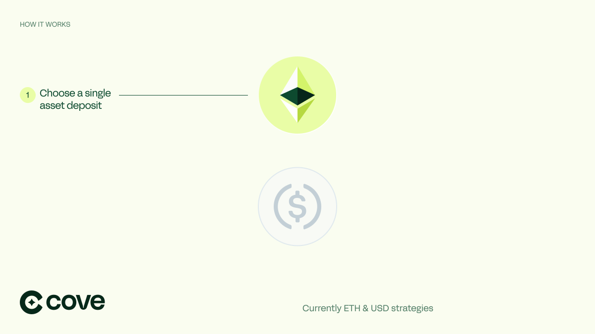
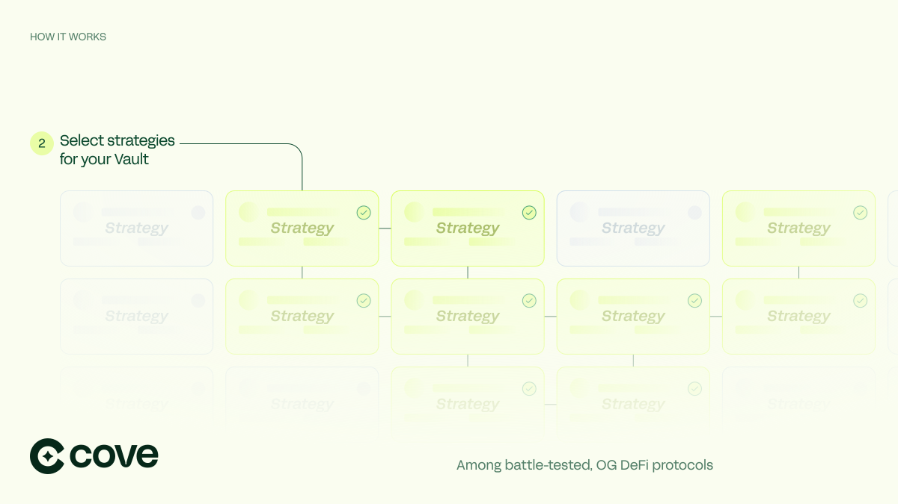
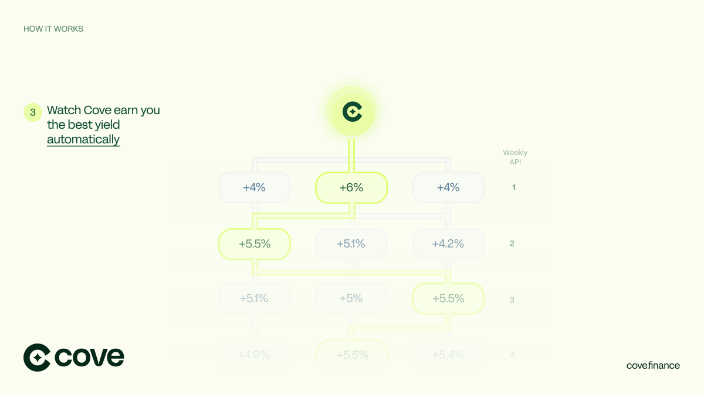

# 🌊 Introducing Cove

<figure><figcaption></figcaption></figure>

### What is Cove?

Cove is the first ERC-4626 yield optimizer with automated and customizable vault management. Earn the best yields on-chain without the hassle of managing a portfolio. Cove is built with the [Yearn](https://yearn.fi/) ecosystem in mind and is optimized by [Gauntlet](https://www.gauntlet.xyz/).

### How does it work?

Cove acts as an intent aggregator for liquidity providers (LPs). Users can open a Cove position (basket) in three steps:

1. Select a base asset, either ETH or USD.
2. Choose an allocation strategy, which specifies how capital will deploy.
   * Planned options include maximum yield (powered by Gauntlet), market cap weighted (enabling custom indexes), or custom weights.
3. Determine which ERC-20/4626 tokens to include.
   * Potential tokens include stablecoins (sDAI, sFRAX, yDAI),  liquid staking tokens (LSTs - stETH, sfrxETH, yETH), or liquid restaking tokens (LRTs).

The protocol aggregates and manages deposits according to user preferences and rebalances periodically. When rebalancing positions, baskets may have a [coincidence of wants](https://en.wikipedia.org/wiki/Coincidence\_of\_wants) (CoW) like ring trades in [CoW Swap’s batch auctions](https://docs.cow.fi/overview/coincidence-of-wants).

Cove maximizes the volume of CoWs using linear programming. This is done by considering the current/target protocol level allocations off-chain. When there are matches, trades occur without losing value from price impact, slippage, fees, or MEV. Any external trades are routed through CoW Swap (which now supports programmatic orders including TWAP via their [Programmatic Order Framework](https://blog.cow.fi/introducing-the-programmatic-order-framework-from-cow-protocol-088a14cb0375)) to ensure the best execution and capture positive slippage.

Cove uses the ERC-4626 tokenized vault standard to combine diverse yield sources. Cove is placing an initial emphasis on Yearn V3 vaults, also known as yVaults. yVaults are “tokenized strategies”, strategies capable of being standalone ERC-4626 vaults themselves. These updated vaults come with a variety of improvements. For a comprehensive list, review the Yearn docs [here](https://docs.yearn.fi/getting-started/products/yvaults/v3).

Users can customize their portfolios by choosing different allocation strategies for each position. Cove rebalances users' portfolios to seek the best yield sources regularly. This ensures users always receive the best annual percentage yield (APY) for their personal risk preferences each week. [Gauntlet](https://www.gauntlet.xyz/) is building and tuning models to achieve this optimization.

<figure><figcaption></figcaption></figure>

<figure><figcaption></figcaption></figure>

<figure><figcaption></figcaption></figure>

### What makes Cove unique?

Traditional AMMs are not well suited for portfolio or index construction because they suffer from [loss-versus-rebalancing (LVR)](https://a16zcrypto.com/posts/article/lvr-quantifying-the-cost-of-providing-liquidity-to-automated-market-makers/). This is because of [toxic order flow](https://insights.deribit.com/market-research/toxic-flow-its-sources-and-counter-strategies/): all trades execute at worse-than-market prices.

Cove proposes an innovative new approach that eliminates LVR and guarantees general intent level execution as a lower bound (e.g. CoW Swap). Internal trades avoid slippage, MEV, price impact, and external trading fees. External trades route through CoW Swap which also protects from MEV and captures positive slippage.

**Key Differentiators**

1. Automation - no more manual management or rebalancing of positions to chase yield. Cove is the next generation of yield farming.
2. Future proof with ERC-4626 support - The new standard makes it easier to integrate yield-bearing vaults, enhances user experiences, and increases security.
3. Harness the Power of Yearn - Cove is building alongside the Yearn ecosystem to include V3 yVaults and boosted veYFI yield from the start. These vaults have been battle tested and offer a variety of attractive features.
